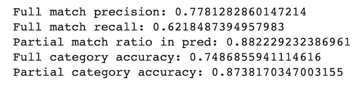
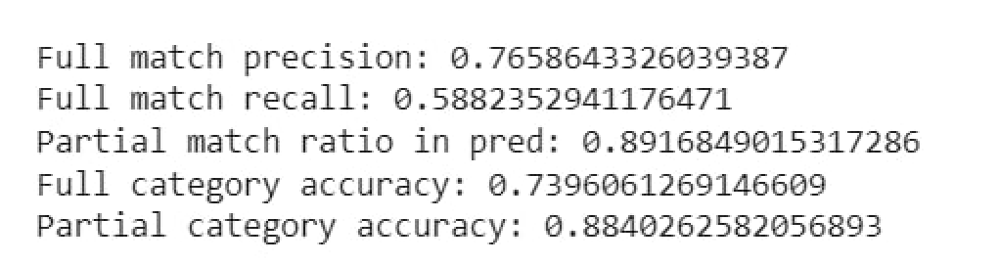
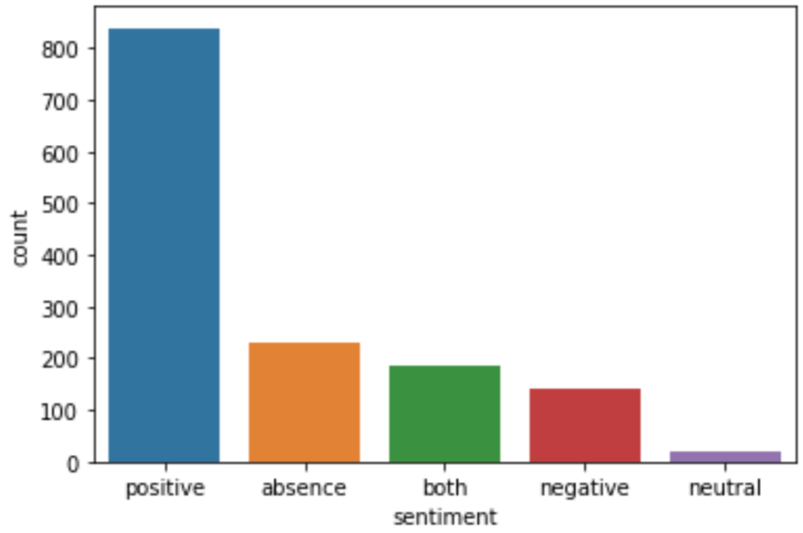

# Aspect Based Sentiment Analysis

В качестве данных были взяты файлы из репозитория для проекта (без изменений)
- **aspects_extraction.ipynb** - часть 1, выделение эксплицитных аспектов
- **aspects_sentiments.ipynb** - часть 2, оценка тональности упоминания аспекта
- **categories.ipynb** - часть 3, оценка тональности всего отзыва по категориям

- **Папка models**: сохраненные модели формата .sav
  - models/part1.sav - модель crf для выделения эксплицитных аспектов 
  - models/part2.sav - модель crf с учетом тональности
  - models/part2.sav - модель LogisticRegression для оценки тональности всего отзыва по категориям

- **Папка files_for_cats**
  - Данные для 3 задания (получаются во 2 задании)

- **Папка predictions**: полученные файлы по заданиям с предсказанными данными 
  - predictions/dev_pred_aspects.txt - эксплицитные аспекты
  - predictions/dev_pred_aspects_sent.txt - тональность упоминания аспекта
  - predictions/dev_pred_cats.txt - тональность отзыва по категориям


# Часть 1 - выделение эксплицитных аспектов
Тексты были размечены в формате BIO, в качестве модели остановились на crf, так как, несмотря на нерваномерное распределение аспектов, результаты получились неплохими

<p align="left">

</p>

| Metric                       | Result             |
|------------------------------|--------------------|
| Full match precision:        | 0.7781282860147214 |
| Full match recall:           | 0.6218487394957983 |
| Partial match ratio in pred: | 0.882229232386961  |
| Full category accuracy:      | 0.7486855941114616 |
| Partial category accuracy:   | 0.8738170347003155 |

Мы попробовали немного изменить функции, генерирующими фичи для crf:
 
Убрали не совсем интуитивные признаки:
```
"word[-3:]": word[-3:],
"word[-2:]": word[-2:],
```

В результате качество стало хуже (за исключением partial метрик), поэтому в модели оставлен изначальный вариант 

**Baseline**:
<p align="center">


**Changed**:
<p align="center">

</p>

# Часть 2 - оценка тональности упоминания аспекта

Во второй части также была использована разметка BIO, но мы склеили ее с тональностями и вновь обучили crf.
Так же были получены файлы для 3 части задания (имена в папки немного отличаются от кода, так как были переименованы вручную для удобства)


| Metric                       | Result             |
|------------------------------|--------------------|
| Fully Matched Pairs:         | 0.7801980198019802 |
| Partially Matched Pairs:     |  0.584070796460177 |

# Часть 3 - оценка тональности всего отзыва по категориям

Распределение категорий по данным:




Мы посчитали количество упоминаний для тональностей по категориям, что использовалось при обучении моделей, затем с помощью GridSearchCV подобрали наиболее оптимальную модель для решения задачи из Random Forest, SVM, LogisticRegression, KNN. Лучшие результаты показала логистическая регрессия (LogisticRegression(C=0.12648552168552957)), на которой была в итоге обучена модель 


| Metric                       | Result             |
|------------------------------|--------------------|
| Overall sentiment accuracy: | 0.7718309859154929 |


