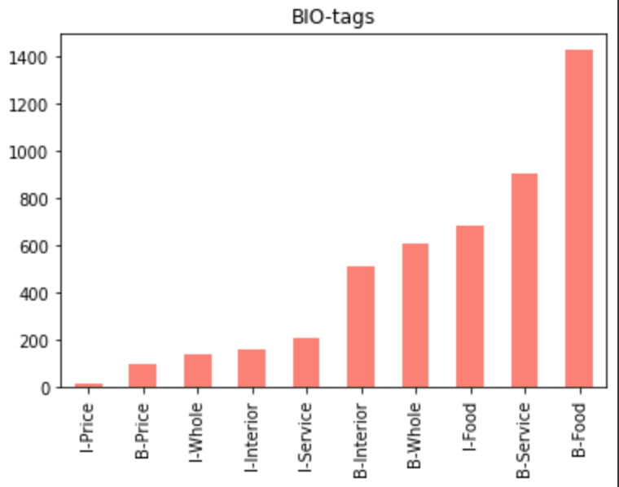

# Aspect Based Sentiment Analysis

В качестве данных были взяты файлы из репозитория для проекта, не изменялись

- **Папка models**: сохраненные модели формата .sav
  - models/part1.sav - модель crf для выделения эксплицитных аспектов 
  - models/part2.sav - модель crf с учетом тональности

- **

# Часть 1 - выделение эксплицитных аспектов

| Metric                       | Result             |
|------------------------------|--------------------|
| Full match precision:        | 0.7781282860147214 |
| Full match recall:           | 0.6218487394957983 |
| Partial match ratio in pred: | 0.882229232386961  |
| Full category accuracy:      | 0.7486855941114616 |
| Partial category accuracy:   | 0.8738170347003155 |

# Часть 2 - оценка тональности упоминания аспекта

| Metric                       | Result             |
|------------------------------|--------------------|
| Full match precision:        | 0.7050912584053795 |
| Full match recall:           | 0.8275084554678692 |
| Partial match ratio in pred: | 0.7973102785782901 |
| Full category accuracy:      | 0.6954851104707013 |
| Partial category accuracy:   | 0.6954851104707013 |

